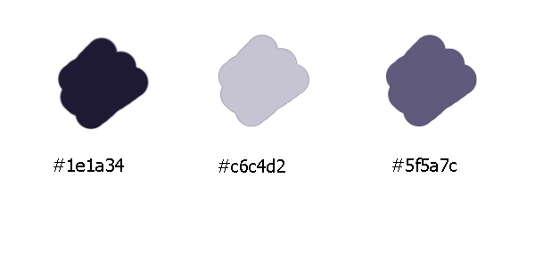

# Hotel Benciati
> Bienvenido/a a la página web oficial del Hotel Benciati. Esta es una página web estática desarrollada utilizando HTML5, CSS3 y el framework Bootstrap.

## descripcion de sitio
El Hotel Benciati es un lujoso y emocionante destino donde la elegancia y la diversión se combinan para brindarte una experiencia inolvidable. Nuestra página web presenta todas las comodidades y servicios que ofrecemos, desde habitaciones premium hasta un emocionante casino, un relajante spa y una refrescante piscina. Además, también puedes explorar nuestras elegantes salas de conferencia y espacios para eventos, perfectamente diseñados para cualquier ocasión.
> Este sitio web esta diseñado sin fines de lucro y con la consigna del proyecto final del curso impartido por Coderhouse.

## Origen
Este sitio web fue diseñado con la consigna de presentar un proyecto final en el curso de Desarrollo Wed de Coderhouse, el cual constaba de diseñar y desarrollar un sitio web estatico que contenga 5 paginas. La idea principal fue realizar un sitio web que refiera a un hotel, por lo que empece a investigar sitios webs de Hoteleria y turismo. Despues de ver varias referencias fui tomando lo bueno y descartando lo malo de cada una, y decidi crear la marca Benciati como el nombre de mi Hotel. Entre las imagenes encontradas de famosos hoteles, elegi el hotel australiano The Star Gold. Tome la desicion de hacerlo en ingles.

Link de figma : https://www.figma.com/file/9MgTpzsO975bukDC1XFbYZ/Coderhouse?type=design&node-id=0%3A1&mode=design&t=DsWaPyU4Bb8qINAM-1

##Metodologias y Diseño
Para el diseño elegi una gama de colores que fueran serios y esteticos, con la intencion de crear un sitio web serio. Toda la pagina esta basada en tres colores: 

Las tipografias que utilice fueron:
Titulos: Playfair Display
Parrafos: Antic

Al diseñar el figma se tuvo en cuenta conceptos como accesibilidad para el usuario, y que sea una navegacion intuitiva, en cuanto a los botones, y los componentes interactivos. el diseño principal del figma tenia arriba de la barra de navegacion un menu para cambiar de idioma la pagina, tome la decision de sacar este boton, ya que el navegador que utilizamos tiene una opcion para traducir el sitio al español. Otros cambios que surgieron en el proyecto fue cuando vimos el framework Boostrap, y pude usar varios componentes y personalizarlos de acuerdo a mi sitio web, por lo que le agrego mas estetica a la pagina, como por ejemplo en la pagina Home (index).

##Tecnologias
- HTML5: Utilice HTML5 para estructurar y crear el contenido de la página web.
- CSS3: Utilice CSS3 para dar estilo y diseño a la página web, asegurando una  		presentación visual atractiva y una experiencia de usuario mejorada.
- Bootstrap: Hice uso del framework Bootstrap para aprovechar sus componentes y estilos predefinidos, lo que permitió desarrollar rápidamente una página web responsiva y con un diseño moderno.

### Profesor
Maximiliano Cardenas

#### Tutor
Yeison Rodriguez